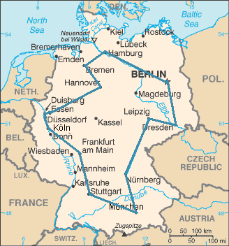

# TSP Fourmis
### Théo Mehamli 
>Les algorithmes de colonies de fourmis (en anglais, ant colony optimization, ou ACO) sont des algorithmes inspirés du comportement des fourmis.(
[source](https://fr.wikipedia.org/wiki/Algorithme_de_colonies_de_fourmis))

>le problème du voyageur de commerce est un problème d'optimisation qui, étant donné une liste de villes, et des distances entre toutes les paires de villes2, détermine un plus court chemin qui visite chaque ville une et une seule fois et qui termine dans la ville de départ.

([source](https://fr.wikipedia.org/wiki/Problème_du_voyageur_de_commerce))

## Objectif
Implémenter un algorithme de colonnies de fourmis afin de résoudre le problème du voyageur de commerce.

#### Initialisation et paramètres

### Début

On peut voir apparaître ici pour chaque fourmis, la distance du chemin qu'elle considère. Ainsi que le meilleur chemin trouvé jusqu'a présent.
### Fin

On remarque, la convergence des chemins choisis par les fourmis.
